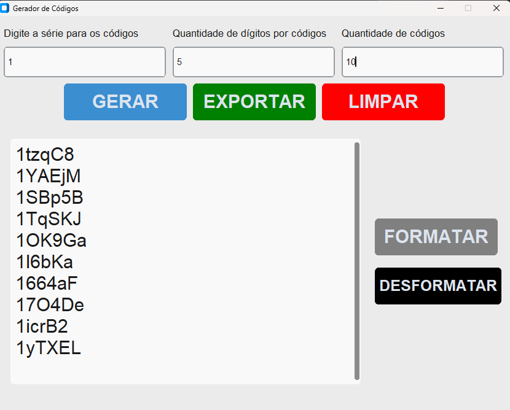
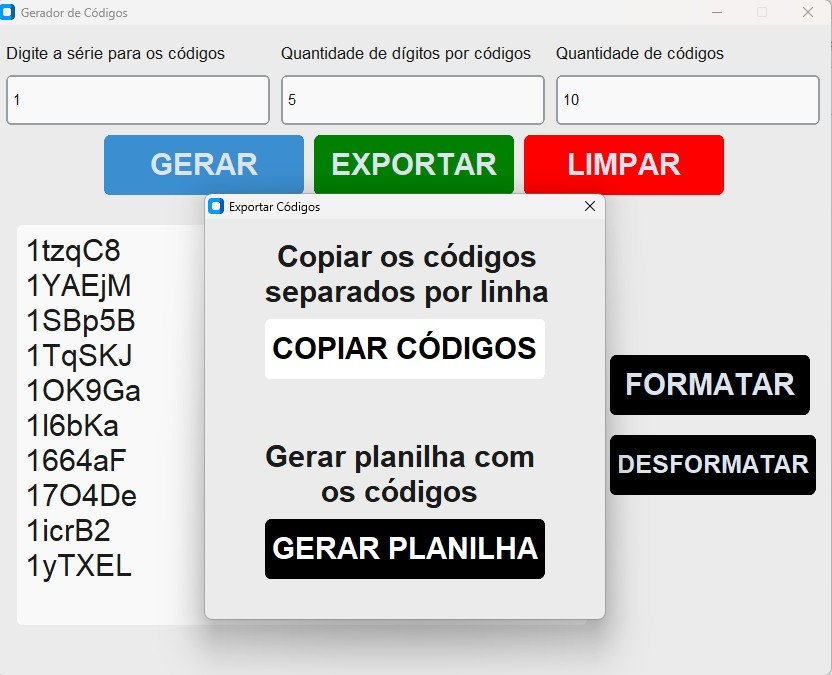
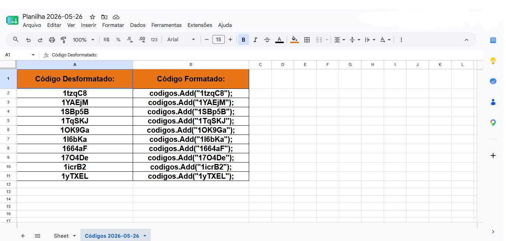

# Gerador de Códigos

## Descrição
Aplicação desktop desenvolvida em Python para geração de códigos personalizados com exportação para Excel.

## Tecnologias
- Python
- CustomTKInter
- OpenPyXL

## Funcionalidades
- Geração de códigos aleatórios
- Formatação automática
- Exportação para planilhas
- Interface Gráfica
- Cópia rápida

## Screenshots

